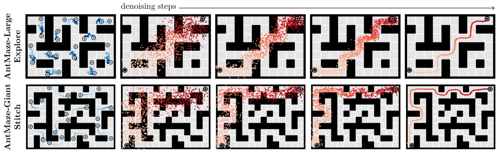

# State-Covering Trajectory Stitching for Diffusion Planners

ArXiv: TODO

Diffusion-based generative models are emerging as powerful tools for long-horizon planning in reinforcement learning (RL), particularly with offline datasets. However, their performance is fundamentally limited by the quality and diversity of training data. This often restricts their generalization to tasks outside their training distribution or longer planning horizons. To overcome this challenge, we propose *State-Covering Trajectory Stitching* (SCoTS), a novel reward-free trajectory augmentation method that incrementally stitches together short trajectory segments, systematically generating diverse and extended trajectories. SCoTS first learns a temporal distance-preserving latent representation that captures the underlying temporal structure of the environment, then iteratively stitches trajectory segments guided by directional exploration and novelty to effectively cover and expand this latent space. We demonstrate that SCoTS significantly improves the performance and generalization capabilities of diffusion planners on offline goal-conditioned benchmarks requiring stitching and long-horizon reasoning. Furthermore, augmented trajectories generated by SCoTS significantly improve the performance of widely used offline goal-conditioned RL algorithms across diverse environments.

<p align='center'>
    
</p>

## Table of Contents

-   [Installation](#installation)
-   [Running Experiments](#running-experiments)
    -   [Diffusion Planning with SCoTS-Augmented Data (Sec 4.3)](#diffusion-planning-with-scots-augmented-data-sec-43)
    -   [Offline GCRL with SCoTS-Augmented Data (Sec 4.4)](#offline-gcrl-with-scots-augmented-data-sec-44)

---

## Installation

1.  **Create and activate a Conda environment:**
    We recommend using Python 3.9.
    ```bash
    conda create -n scots python=3.9
    conda activate scots
    ```

2.  **Install project dependencies:**
    This command installs the current project in editable mode and then installs dependencies from `requirements.txt`. Ensure `requirements.txt` is comprehensive.
    ```bash
    pip install -e .
    pip install -r requirements.txt
    ```

---

## Running Experiments

This section details how to reproduce the main experimental results presented in the paper.

### Diffusion Planning with SCoTS-Augmented Data (Sec 4.3)

This involves a pipeline of training several components:
*All scripts are assumed to be run from the root directory of this repository.*

1.  **Train Inverse Dynamics Model:**
    This model is used by SCoTS to predict actions for state-only stitched trajectories.
    ```bash
    bash scripts/invdyn.sh
    ```

2.  **Train Temporal Distance-Preserving Representation ($\phi$):**
    ```bash
    cd scripts/HILP
    # Train the JAX-based model
    bash hilp_ogbench.sh
    # Convert the trained JAX model to torch model
    bash hilp_jax2torch.sh
    cd ../.. # Return to the root directory
    ```

3.  **Train SCoTS Stitcher and Augment Data:**
    This step trains the diffusion-based stitcher component of SCoTS and then uses the complete SCoTS pipeline (trained $\phi$, stitcher, and inverse dynamics model) to generate the augmented dataset $\mathcal{D}_{\text{aug}}$.
    ```bash
    bash scripts/stitcher.sh
    ```
    Augmented datasets (e.g., `{env_name}_augmented.npz` and `{env_name}_augmented-val.npz`) will be saved, typically under a path like `results/stitcher_ogbench_H26/{env_name}/`.

4.  **Train Low-Level Controllers:**
    ```bash
    cd scripts/low_level_controller
    # Train JAX model
    bash gciql.sh
    # Convert JAX model to torch model
    bash gciql_jax2torch.sh

    # Train JAX model
    bash crl.sh
    # Convert JAX model to torch model
    bash crl_jax2torch.sh
    cd ../.. # Return to the root directory
    ```

5.  **Train and Evaluate Diffusion Planner (HD) with SCoTS-Augmented Data:**
    This step trains the Hierarchical Diffusion (HD) planner using the augmented dataset generated in Step 3.
    ```bash
    # Train the HD planner
    bash scripts/scots.sh
    # Evaluate the trained HD planner
    bash scripts/scots_eval.sh
    ```

---

### Offline GCRL with SCoTS-Augmented Data (Sec 4.4)

This section explains how to evaluate standard offline Goal-Conditioned Reinforcement Learning (GCRL) algorithms using datasets augmented by SCoTS.

**A. Baseline Performance (Without SCoTS Augmentation):**

To obtain the baseline performance of GCRL algorithms on the original (non-augmented) datasets, you can use the official OGBench implementation:
1.  Clone the OGBench repository:
    ```bash
    git clone https://github.com/seohongpark/ogbench.git
    cd ogbench
    ```
2.  Run experiments using their `impls/main.py` script as described in their documentation.

**B. Performance with SCoTS-Augmented Data:**

To train and evaluate GCRL algorithms on SCoTS-augmented data:

1.  **Prepare Augmented Data:**
    * After running Step 3 from the [Diffusion Planning with SCoTS-Augmented Data (Sec 4.3)](#diffusion-planning-with-scots-augmented-data-sec-43) section (i.e., `bash scripts/stitcher.sh`), your SCoTS-augmented data files (e.g., `{env_name}_augmented.npz` and `{env_name}_augmented-val.npz`) will be available, typically in a path like `results/stitcher_ogbench_H26/{env_name}/` within this (SCoTS) repository.
    * Navigate to the `impls` directory of your cloned OGBench repository (from step A.1 above).
    * Create a subdirectory for the augmented data:
        ```bash
        mkdir aug_data
        ```
    * For each environment you want to test (e.g., `pointmaze-medium-stitch-v0`), copy the corresponding `_augmented.npz` and `_augmented-val.npz` files from your SCoTS results directory into this `ogbench/impls/aug_data/` directory.

2.  **Use the Modified Training Script (`main_aug.py`):**
    Instead of the original `ogbench/impls/main.py`, you will use the following `main_aug.py` script. This script is modified to load the augmented datasets.
    * Save the code block below as `main_aug.py` inside the `ogbench/impls/` directory.

    ```python
    # main_aug.py
    import json
    import os
    import random
    import time
    import ogbench
    from ogbench.utils import load_dataset
    from collections import defaultdict
    from datetime import datetime

    import jax
    import numpy as np
    import tqdm
    import wandb
    from absl import app, flags
    from agents import agents
    from ml_collections import config_flags
    from utils.datasets import Dataset, GCDataset, HGCDataset
    from utils.env_utils import FrameStackWrapper # make_env_and_datasets
    from utils.evaluation import evaluate
    from utils.flax_utils import restore_agent, save_agent
    from utils.log_utils import CsvLogger, get_exp_name, get_flag_dict, get_wandb_video, setup_wandb

    FLAGS = flags.FLAGS

    flags.DEFINE_string('run_group', 'Debug', 'Run group.')
    flags.DEFINE_integer('seed', 0, 'Random seed.')
    flags.DEFINE_string('env_name', 'antmaze-large-navigate-v0', 'Environment (dataset) name.')
    flags.DEFINE_string('save_dir', 'exp_aug/', 'Save directory.')
    flags.DEFINE_string('restore_path', None, 'Restore path.')
    flags.DEFINE_integer('restore_epoch', None, 'Restore epoch.')

    flags.DEFINE_integer('train_steps', 1000000, 'Number of training steps.')
    flags.DEFINE_integer('log_interval', 5000, 'Logging interval.')
    flags.DEFINE_integer('eval_interval', 100000, 'Evaluation interval.')
    flags.DEFINE_integer('save_interval', 1000000, 'Saving interval.')

    flags.DEFINE_integer('eval_tasks', None, 'Number of tasks to evaluate (None for all).')
    flags.DEFINE_integer('eval_episodes', 20, 'Number of episodes for each task.')
    flags.DEFINE_float('eval_temperature', 0, 'Actor temperature for evaluation.')
    flags.DEFINE_float('eval_gaussian', None, 'Action Gaussian noise for evaluation.')
    flags.DEFINE_integer('video_episodes', 1, 'Number of video episodes for each task.')
    flags.DEFINE_integer('video_frame_skip', 3, 'Frame skip for videos.')
    flags.DEFINE_integer('eval_on_cpu', 1, 'Whether to evaluate on CPU.')

    # Add the aug_only flag
    flags.DEFINE_bool('aug_only', True, 'Whether to use only augmented data for training.')

    config_flags.DEFINE_config_file('agent', 'agents/gciql.py', lock_config=False)


    def make_env_and_datasets(dataset_name, aug_dataset_dir='./aug_data', frame_stack=None, aug_only=False):
        """Make OGBench environment and datasets.

        Args:
            dataset_name: Name of the dataset.
            frame_stack: Number of frames to stack.

        Returns:
            A tuple of the environment, training dataset, and validation dataset.
        """
        # Use compact dataset to save memory.
        env, train_dataset, val_dataset = ogbench.make_env_and_datasets(dataset_name, compact_dataset=True)

        # === aug ===
        ob_dtype = np.uint8 if ('visual' in dataset_name or 'powderworld' in dataset_name) else np.float32
        action_dtype = np.int32 if 'powderworld' in dataset_name else np.float32
        aug_train_dataset = load_dataset(
            os.path.join(aug_dataset_dir, f'{dataset_name}'+'_augmented.npz'),
            ob_dtype=ob_dtype,
            action_dtype=action_dtype,
            compact_dataset=True,
            add_info=False,
        )
        aug_val_dataset = load_dataset(
            os.path.join(aug_dataset_dir, f'{dataset_name}'+'_augmented-val.npz'),
            ob_dtype=ob_dtype,
            action_dtype=action_dtype,
            compact_dataset=True,
            add_info=False,
        )
        
        if aug_only:
            train_dataset = aug_train_dataset
            val_dataset = aug_val_dataset
        else:
            train_dataset = {
                key: np.concatenate([train_dataset[key], aug_train_dataset[key]], axis=0)
                for key in train_dataset.keys()
            }
            val_dataset = {
                key: np.concatenate([train_dataset[key], aug_train_dataset[key]], axis=0)
                for key in val_dataset.keys()
            }

        print(train_dataset['observations'].shape)

        train_dataset = Dataset.create(**train_dataset)
        val_dataset = Dataset.create(**val_dataset)

        if frame_stack is not None:
            env = FrameStackWrapper(env, frame_stack)

        env.reset()

        return env, train_dataset, val_dataset


    def main(_):
        config = FLAGS.agent

        run_name = f"{config['agent_name']}-{FLAGS.env_name}-aug_only_{FLAGS.aug_only}"
        # run_name += f'-{datetime.now().strftime("%Y%m%d_%H%M%S")}'
        setup_wandb(project='OGBench-aug', group=FLAGS.run_group, name=run_name)

        FLAGS.save_dir = os.path.join(FLAGS.save_dir, wandb.run.project, FLAGS.run_group, run_name)
        os.makedirs(FLAGS.save_dir, exist_ok=True)
        flag_dict = get_flag_dict()
        with open(os.path.join(FLAGS.save_dir, 'flags.json'), 'w') as f:
            json.dump(flag_dict, f)

        # Set up environment and dataset.
        env, train_dataset, val_dataset = make_env_and_datasets(
            FLAGS.env_name, frame_stack=config['frame_stack'],
            aug_only=FLAGS.aug_only
        )

        dataset_class = {
            'GCDataset': GCDataset,
            'HGCDataset': HGCDataset,
        }[config['dataset_class']]
        train_dataset = dataset_class(Dataset.create(**train_dataset), config)
        if val_dataset is not None:
            val_dataset = dataset_class(Dataset.create(**val_dataset), config)

        # Initialize agent.
        random.seed(FLAGS.seed)
        np.random.seed(FLAGS.seed)

        example_batch = train_dataset.sample(1)
        if config['discrete']:
            # Fill with the maximum action to let the agent know the action space size.
            example_batch['actions'] = np.full_like(example_batch['actions'], env.action_space.n - 1)

        agent_class = agents[config['agent_name']]
        agent = agent_class.create(
            FLAGS.seed,
            example_batch['observations'],
            example_batch['actions'],
            config,
        )

        # Restore agent.
        if FLAGS.restore_path is not None:
            agent = restore_agent(agent, FLAGS.restore_path, FLAGS.restore_epoch)

        # Train agent.
        train_logger = CsvLogger(os.path.join(FLAGS.save_dir, 'train.csv'))
        eval_logger = CsvLogger(os.path.join(FLAGS.save_dir, 'eval.csv'))
        first_time = time.time()
        last_time = time.time()
        for i in tqdm.tqdm(range(1, FLAGS.train_steps + 1), smoothing=0.1, dynamic_ncols=True):
            # Update agent.
            batch = train_dataset.sample(config['batch_size'])
            agent, update_info = agent.update(batch)

            # Log metrics.
            if i % FLAGS.log_interval == 0:
                train_metrics = {f'training/{k}': v for k, v in update_info.items()}
                if val_dataset is not None:
                    val_batch = val_dataset.sample(config['batch_size'])
                    _, val_info = agent.total_loss(val_batch, grad_params=None)
                    train_metrics.update({f'validation/{k}': v for k, v in val_info.items()})
                train_metrics['time/epoch_time'] = (time.time() - last_time) / FLAGS.log_interval
                train_metrics['time/total_time'] = time.time() - first_time
                last_time = time.time()
                wandb.log(train_metrics, step=i)
                train_logger.log(train_metrics, step=i)

            # Evaluate agent.
            if i == 1 or i % FLAGS.eval_interval == 0:
                if FLAGS.eval_on_cpu:
                    eval_agent = jax.device_put(agent, device=jax.devices('cpu')[0])
                else:
                    eval_agent = agent
                renders = []
                eval_metrics = {}
                overall_metrics = defaultdict(list)
                task_infos = env.unwrapped.task_infos if hasattr(env.unwrapped, 'task_infos') else env.task_infos
                num_tasks = FLAGS.eval_tasks if FLAGS.eval_tasks is not None else len(task_infos)
                for task_id in tqdm.trange(1, num_tasks + 1):
                    task_name = task_infos[task_id - 1]['task_name']
                    eval_info, trajs, cur_renders = evaluate(
                        agent=eval_agent,
                        env=env,
                        task_id=task_id,
                        config=config,
                        num_eval_episodes=FLAGS.eval_episodes,
                        num_video_episodes=FLAGS.video_episodes,
                        video_frame_skip=FLAGS.video_frame_skip,
                        eval_temperature=FLAGS.eval_temperature,
                        eval_gaussian=FLAGS.eval_gaussian,
                    )
                    renders.extend(cur_renders)
                    metric_names = ['success']
                    eval_metrics.update(
                        {f'evaluation/{task_name}_{k}': v for k, v in eval_info.items() if k in metric_names}
                    )
                    for k, v in eval_info.items():
                        if k in metric_names:
                            overall_metrics[k].append(v)
                for k, v in overall_metrics.items():
                    eval_metrics[f'evaluation/overall_{k}'] = np.mean(v)

                if FLAGS.video_episodes > 0:
                    video = get_wandb_video(renders=renders, n_cols=num_tasks)
                    eval_metrics['video'] = video

                wandb.log(eval_metrics, step=i)
                eval_logger.log(eval_metrics, step=i)

            # Save agent.
            if i % FLAGS.save_interval == 0:
                save_agent(agent, FLAGS.save_dir, i)

        train_logger.close()
        eval_logger.close()


    if __name__ == '__main__':
        app.run(main)
    ```

3.  **Run the Experiment:**
    Navigate to the `ogbench/impls/` directory (where you saved `main_aug.py` and placed the `aug_data` folder) and run the script `main_aug.py`.
